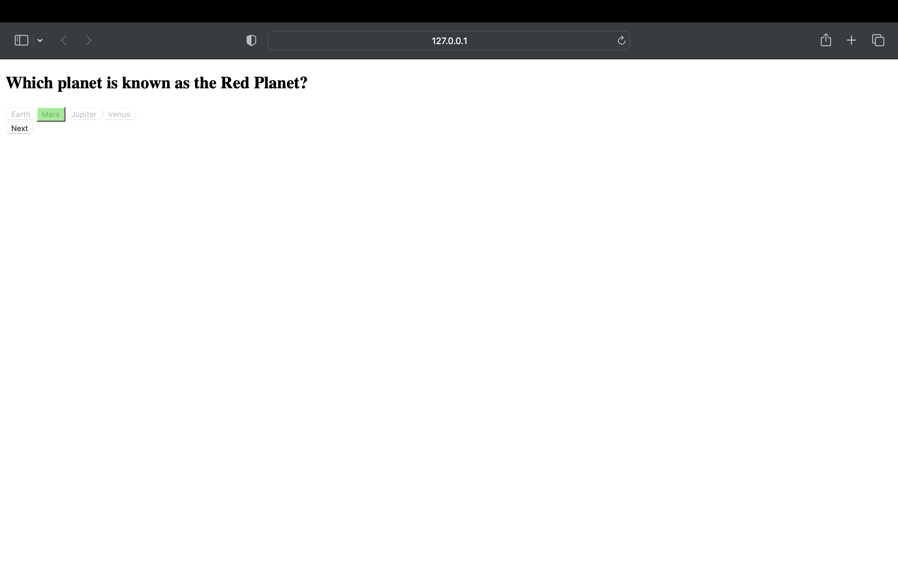
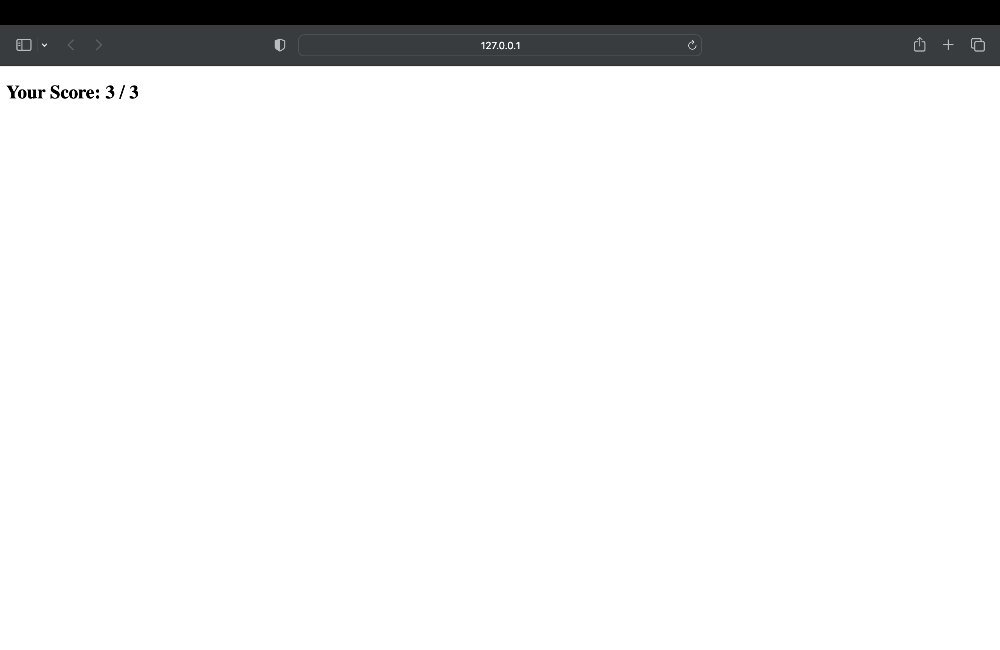

# 📝 Quiz/Assessment Platform

An interactive and user-friendly platform designed to deliver smooth, responsive, and engaging quiz experiences. Focused on clarity, instant feedback, and efficient navigation, this platform enables learners to assess their knowledge effectively in real time.

---

## ✨ Core Features

### ⚡ Instant Feedback
- Provides **real-time feedback** after each question submission  
- Reinforces learning by immediately indicating correct or incorrect answers  
- Encourages user reflection and prevents repeated mistakes  
- Keeps users engaged and in flow throughout the quiz  

### 📊 Score Tracking & Final Result Display
- Tracks performance with **live or end-of-quiz scoring**  
- Displays **final result summary**, including:  
  - Total score  
  - Correct vs. incorrect answers  
  - Optional performance comments or improvement tips  
- Encourages goal-setting and self-assessment  

### 🔁 Smooth Navigation
- Allows users to **move freely** between questions  
  - Forward, backward, or skip-and-return  
- Ensures a **distraction-free and intuitive flow**  
- Especially helpful during **timed quizzes** to reduce stress  

### 🖱️ Easy-to-Use Interface
- Clean, accessible layout with readable fonts and clear labels  
- Interactive elements like **hover effects, answer highlights, and transitions**  
- Compatible across **smartphones, tablets, and desktops**  
- Zero learning curve — designed for users of all technical backgrounds  

---

## 🔧 Tech Stack

- **Frontend**: HTML, CSS, JavaScript  

---

## 📸 Screenshots

---

## 👩‍💻 Author

**Muhamudha Aqsa M A**  
Aspiring Technical Writer with a developer background
📧 muhamudhaaqsa@gmail.com  
🔗 [LinkedIn](https://linkedin.com/in/muhamudhaaqsa)

---
